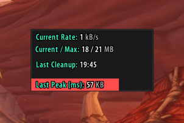

# pfDebug

A little tool to monitor the memory usage, peaks and garbage collection.

**WARNING: This is still in an early development state!**

## Installation
1. Download **[Latest Version](https://gitlab.com/shagu/pfDebug/-/archive/master/pfDebug-master.zip)**
2. Unpack the Zip file
3. Rename the folder "pfDebug-master" to "pfDebug"
4. Copy "pfDebug" into Wow-Directory\Interface\AddOns
5. Restart Wow
